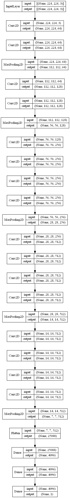
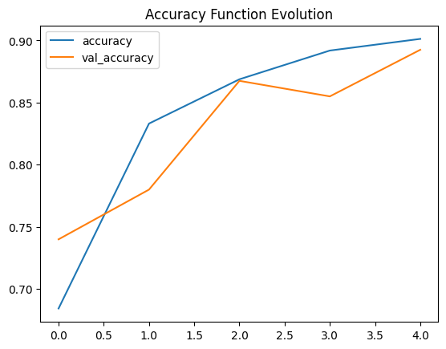

# Face Mask Detection using VGG Model
Camera face mask detection using VGG19 model

[Dataset](https://github.com/chandrikadeb7/Face-Mask-Detection)

## Contents
### Data Understanding
The original data contains 4k images, but we reduce it to 2k. So there are 2k images belonging to the 2 classes.

### Modeling
We use VGG19 model and remove top of it to add one dense layer with 1 unit.

### Evaluation
* Accuracy plot

* 
### Prediction
We use this model to detect face mask from camera.